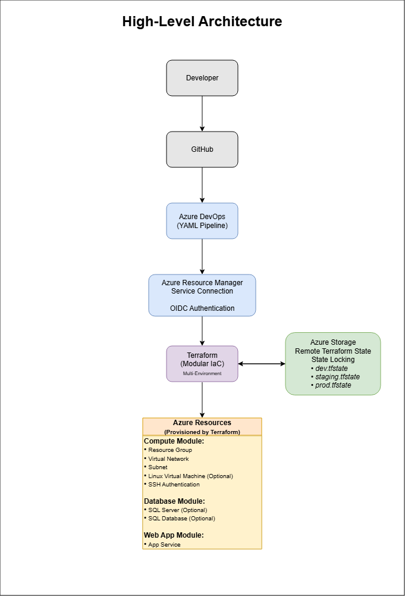

# Terraform on Azure: Infrastructure as Code with Azure DevOps


## Overview

This project demonstrates an enterprise-style **Infrastructure as Code (IaC)** implementation using **Terraform**, **Microsoft Azure**, and **Azure DevOps**.

The solution provisions Azure infrastructure through reusable Terraform modules while using Azure DevOps YAML pipelines to automate validation, planning, and deployment across Development, Staging, and Production environments.

The project follows Infrastructure as Code best practices including:

* Modular Terraform design
* Remote Terraform state
* Environment-specific configuration
* Azure DevOps CI/CD
* Azure Service Connections
* Enterprise tagging strategy
* Secure variable management
* Cost-conscious infrastructure design through optional deployment flags and environment-specific resource provisioning.

---

## Project Highlights

- Built reusable Terraform modules for compute, database, and web application resources
- Automated multi-environment deployments using Azure DevOps YAML pipelines
- Implemented remote Terraform state with Azure Storage and state locking
- Used Azure DevOps Service Connections with OpenID Connect (OIDC) authentication
- Secured sensitive configuration through Azure DevOps Variable Groups
- Implemented optional resource deployment to reduce Azure consumption costs
- Deployed Linux virtual machines using SSH key authentication

---

## Objectives

This project demonstrates how to:

* Deploy Azure infrastructure using Terraform
* Build reusable Terraform modules
* Separate infrastructure by environment
* Store Terraform state remotely
* Automate deployments through Azure DevOps
* Authenticate securely using Azure Service Connections
* Manage infrastructure consistently across environments

---

## Key Features

- Modular Terraform architecture
- Multi-environment deployment
- Remote state isolation
- Azure DevOps CI/CD
- OIDC authentication
- Secure secret management
- SSH-based Linux VM deployment
- Optional infrastructure provisioning
- Enterprise tagging strategy

---

## Technologies

| Technology             | Purpose                |
| ---------------------- | ---------------------- |
| Terraform              | Infrastructure as Code |
| Microsoft Azure        | Cloud Platform         |
| Azure Resource Manager | Resource Provisioning  |
| Azure DevOps           | CI/CD Pipeline         |
| Azure Storage Account  | Remote Terraform State |
| Azure SQL Database     | Database Platform      |
| Azure App Service      | Web Hosting            |
| GitHub                 | Source Control         |
| Git                    | Version Control        |


---

## Architecture


```text
Developer
      │
      ▼
GitHub
      │
      ▼
Azure DevOps Repository
      │
      ▼
Azure DevOps YAML Pipeline
      │
      ▼
Terraform Init
Terraform Validate
Terraform Plan
Terraform Apply
      │
      ▼
Azure Storage
(Remote State)
      │
      ▼
Azure Subscription
      │
      ├── Resource Group
      ├── Virtual Network
      ├── Subnet
      ├── Network Interface
      ├── Linux Virtual Machine (Optional)
      ├── Database
      └── Web Application
```

---

## Repository Structure

```text
terraform-on-azure/

├── environments/
│   ├── dev.tfvars
│   ├── staging.tfvars
│   └── prod.tfvars
│
├── modules/
│   ├── compute/
│   ├── database/
│   └── web-app/
│
├── providers.tf
├── variables.tf
├── outputs.tf
├── main.tf
├── azure-pipelines.yml
└── README.md
```

---

## Infrastructure Components

Current modules include:

### Compute

- Resource Group
- Virtual Network
- Subnets
- Network Interfaces
- Optional Linux Virtual Machines
- SSH key authentication
- Optional deployment for cost management

### Database

* Azure SQL Database resources
* Configurable SKU
* Secure password management

### Web Application

* Azure App Service
* Environment-specific configuration

---

## CI/CD Pipeline

The Azure DevOps pipeline performs the following workflow:

```
Validate
    │
    ▼
Terraform Init
    │
    ▼
Terraform Validate
    │
    ▼
Terraform Plan
    │
    ▼
Deploy Development
    │
    ▼
Deploy Staging
    │
    ▼
Deploy Production
```

Each deployment environment uses:

* Independent variable groups
* Separate Terraform state files
* Azure Service Connection authentication

---

## Remote State Management

Terraform state is stored remotely in Azure Storage.

```
Storage Account
└── tfstate
    ├── dev.tfstate
    ├── staging.tfstate
    └── prod.tfstate
```

This provides:

* State locking
* Team collaboration
* Environment isolation
* Safer deployments

---

## Cost Management

The solution is designed to support cost-conscious development and testing by allowing expensive Azure resources to be deployed only when required.

### Optional Compute Deployment

Linux virtual machines are controlled through deployment flags, allowing infrastructure validation without provisioning compute resources.

```terraform
deploy_vm = false
vm_count  = 0
```

### Optional Database Deployment

Azure SQL Database resources can also be enabled or disabled through a deployment flag.

```terraform
deploy_database = false
```

When disabled, the Azure SQL Server, SQL Database, and associated firewall rules are not provisioned, reducing Azure consumption costs during development and testing.

This approach enables the CI/CD pipeline, Terraform modules, and infrastructure configuration to be fully validated while deploying only the resources required for a given environment.

---

## Security

Sensitive information is not stored in source control.

Secrets and authentication are managed through:

- Azure DevOps Variable Groups
- Azure Resource Manager Service Connections
- OpenID Connect (OIDC) authentication
- Secure pipeline variables

Terraform state is stored securely using Azure Storage with state locking enabled.

---

## Lessons Learned

This project provided practical experience with:

* Terraform module design
* Azure remote backend configuration
* Azure DevOps YAML pipelines
* Azure Service Connections
* Remote state locking
* Azure RBAC permissions
* Provider version management
* Multi-environment deployments
* Troubleshooting complex Infrastructure as Code deployments
* Infrastructure automation

---

## Troubleshooting

Building this project involved resolving a variety of real-world Infrastructure as Code challenges that are commonly encountered in enterprise cloud environments. Key issues addressed during development included:

* **AzureRM Provider Configuration** – Correctly configured the Azure provider for both local development and Azure DevOps pipeline execution, including migration from Azure CLI authentication to OpenID Connect (OIDC).
* **Provider Version Management** – Resolved provider version conflicts by upgrading the AzureRM provider and reinitializing Terraform state with `terraform init -upgrade`.
* **Azure DevOps Service Connections** – Configured Azure Resource Manager service connections to securely authenticate Terraform deployments without interactive credentials.
* **Terraform Remote State** – Implemented an Azure Storage Account backend with state locking to support collaborative Infrastructure as Code deployments.
* **Environment Isolation** – Created independent Terraform state files (`dev.tfstate`, `staging.tfstate`, and `prod.tfstate`) to prevent cross-environment state conflicts.
* **State Lock Recovery** – Diagnosed and resolved Terraform state lock issues caused by interrupted pipeline executions by understanding Azure Blob Storage leases and Terraform locking behavior.
* **Azure RBAC Permissions** – Resolved authorization failures by assigning the appropriate Azure role-based access control (RBAC) permissions to the Azure DevOps service principal.
* **Terraform Modules** – Refactored infrastructure into reusable modules while resolving variable declarations, module inputs, and output dependencies between the root module and child modules.
* **Variable Management** – Implemented environment-specific variable files and Azure DevOps Variable Groups to securely manage configuration values and sensitive data across deployment environments.
* **Azure Networking** – Corrected virtual network and subnet CIDR configurations after identifying address range mismatches that prevented successful subnet creation.
* **Git Repository Management** – Cleaned repository history after accidentally committing a large binary executable by rewriting Git history and implementing `.gitignore` best practices for Terraform projects.
* **Azure DevOps CI/CD Pipeline** – Built a multi-stage deployment pipeline supporting validation, planning, and automated deployments to Development, Staging, and Production environments using environment-specific configuration and remote state.
* **Terraform State Management Issues** - During initial pipeline execution, all environments were incorrectly configured to use a shared state file. This caused Terraform to treat all environments as a single infrastructure stack resulting in incorrect drift detection issues, destructive resource placement, and unintended cross-environment changes. This was corrected by configuring a separate state file for each environment.

These troubleshooting exercises reinforced practical skills in Infrastructure as Code, Azure administration, CI/CD automation, cloud security, Git workflows, and operational problem solving.

---

## Future Enhancements

Planned improvements include:

* Network Security Groups
* Azure Key Vault integration
* Managed Identities
* Diagnostic Settings
* Azure Monitor integration
* Destroy pipeline
* Static code analysis
* Policy as Code
* Private Endpoints

